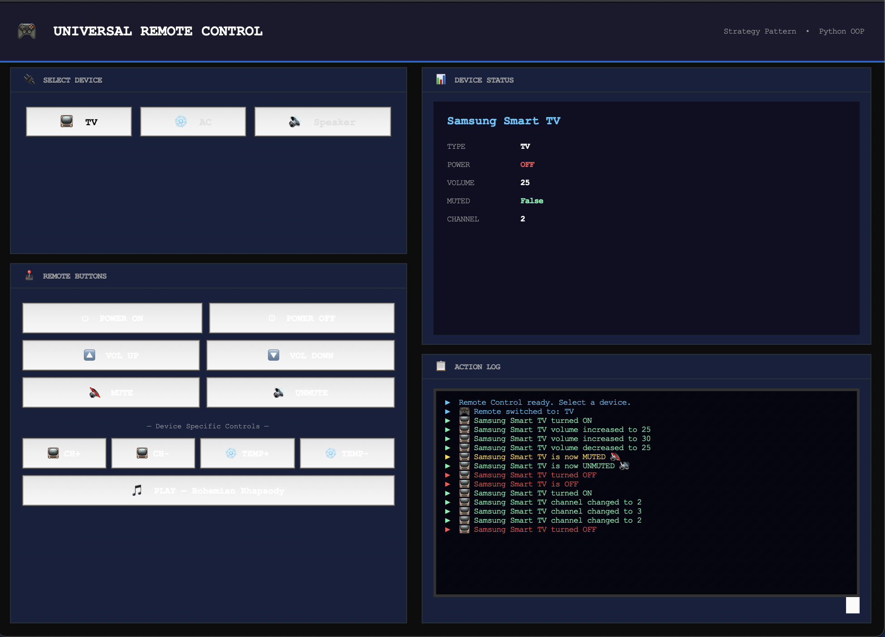
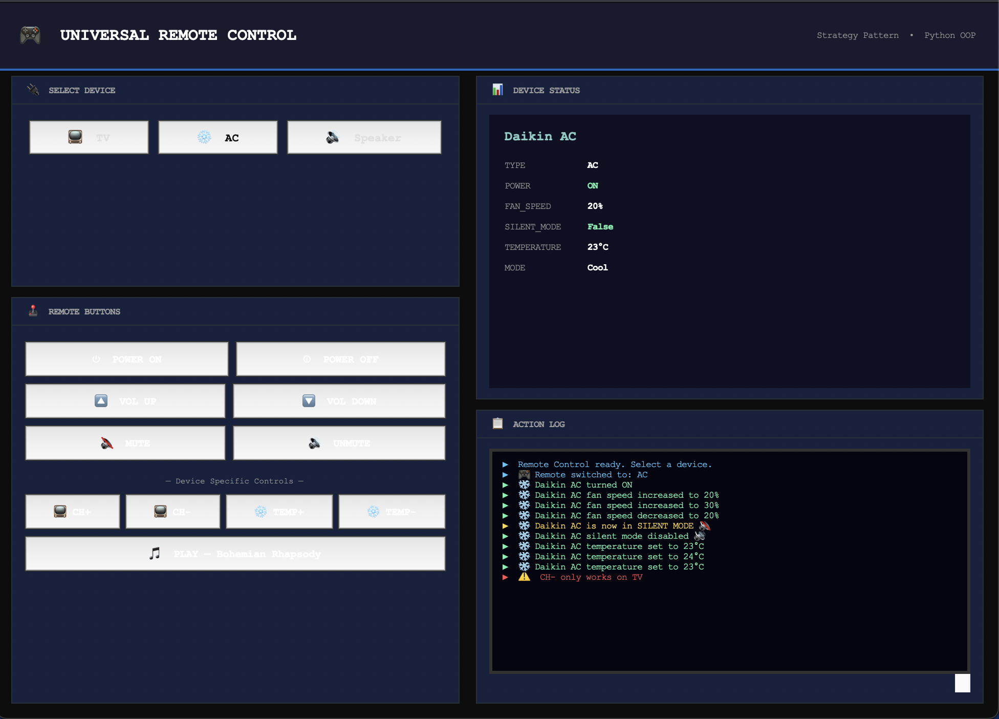
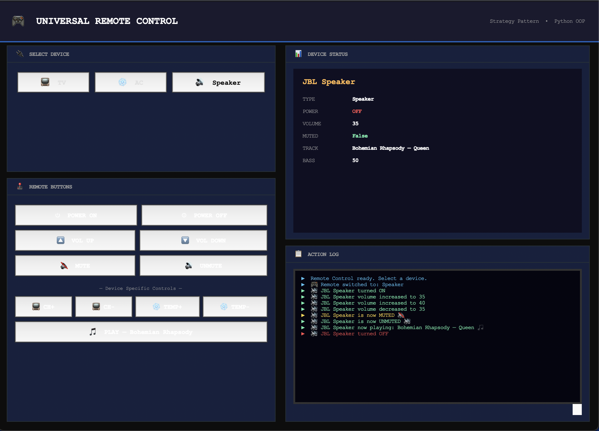

# Universal Remote Control - Strategy Design Pattern

A comprehensive smart device management simulation developed using the **Strategy Design Pattern** and **Python OOP** principles. This application features a modern graphical user interface (GUI) to control various smart devices dynamically.

## 🚀 Overview
The project simulates how different electronic devices like TVs, Air Conditioners (AC), and Speakers can be managed through a single universal remote interface. By implementing the **Strategy Pattern**, the system ensures that each device handles commands (like Power, Volume, or Temperature) according to its own specific logic without changing the core remote control code.

## 📸 User Interface
The application provides a dedicated control layout for each device type:

| Samsung Smart TV | Daikin AC (Climate) | JBL Speaker |
|:---:|:---:|:---:|
|  |  |  |

## 🛠 How to Run
You can launch the application using the following commands in your terminal:

1. **To run the Graphical Interface (GUI):**
   ```bash
   python gui.py

2. **To run the Logic Demo:**
   ```bash
   python main.py

## 🧩 Key Features & Design
Strategy Pattern: Decouples the device logic from the remote control interface.

Scalability: New devices can be added easily by creating a new strategy class.

Tkinter GUI: A dark-themed, user-friendly interface with real-time action logs.

Device Specifics: Custom controls for TV channels, AC temperature, and Speaker track management.
